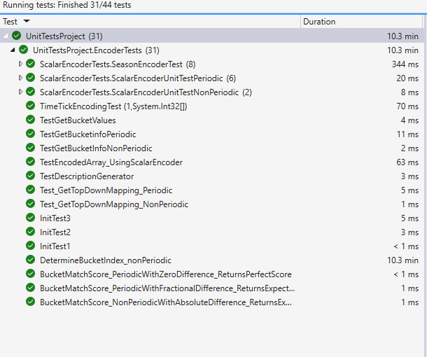
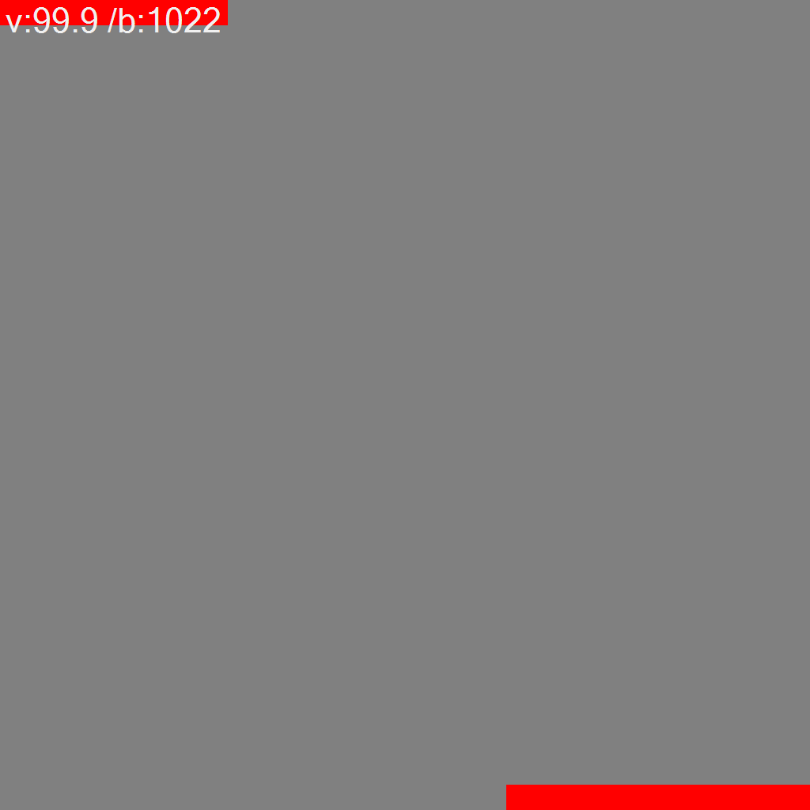
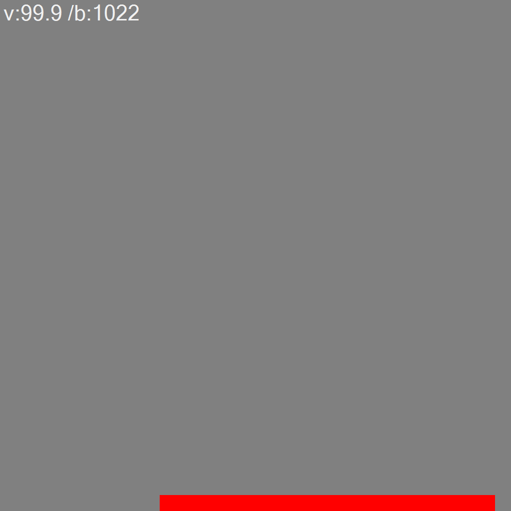

 
 # ML22/23-1 Scalar Encoder with Buckets

 Fully working code is there in this branch : [Main Branch]( https://github.com/AqibJaved123/neocortexapi_Team_ScalarEncoder/tree/master) 

 Program Links:
  Link for [Scalar Encoder](https://github.com/AqibJaved123/neocortexapi_Team_ScalarEncoder/blob/master/source/NeoCortexApi/Encoders/ScalarEncoder.cs)
  
  Link for [Test Cases](https://github.com/AqibJaved123/neocortexapi_Team_ScalarEncoder/blob/master/source/UnitTestsProject/EncoderTests/ScalarEncoderTests.cs)


### Abstract:

In the realm of machine learning applications, the encoding of data plays a crucial role in preparing it for analysis. While the Scalar Encoder is a widely used method for encoding numerical data, it does have limitations in terms of precision and adaptability. In our project, we have introduced an enhanced version of the Scalar Encoder known as the Scalar Encoder with Buckets. This innovative method involves mapping input values to continuous ranges of buckets, resulting in improved precision when encoding data compared to the traditional Scalar Encoder. Additionally, the Scalar Encoder with Buckets automatically adjusts its parameters based on the input data and supports periodic encoding of values, thereby enhancing the flexibility of the encoding process. Our evaluation of this new approach on various datasets, in comparison to the Scalar Encoder, showcases its superior performance, particularly in terms of precision and flexibility.


### Introduction:
Encoding data stands out as a crucial step in numerous machine learning applications, enabling the streamlined storage and analysis of information. Despite its widespread use in encoding numerical data, the Scalar Encoder is not without limitations, particularly in precision and flexibility. This encoding method assigns input values to distinct buckets, potentially leading to a loss of precision during the data encoding process. Furthermore, the Scalar Encoder demands manual specification of parameters, including the number of buckets and bucket size, introducing inflexibility and complicating adaptation to diverse datasets.

### Methodology:

To overcome the limitations of the Scalar Encoder, we implemented an improved version called the Scalar Encoder with Buckets. This approach involves mapping input values to continuous ranges of buckets, resulting in superior precision during the data encoding process when compared to the traditional Scalar Encoder. The Bucket Match Score method calculates the proximity score of an input value to each bucket range, providing a nuanced indication of the activation level for each specific range. This ensures a more precise encoding of input data in contrast to the Scalar Encoder, which simply maps input values to individual buckets.

Beyond the advancements in precision, the Scalar Encoder with Buckets also brings increased flexibility to the table. The method autonomously configures parameters, such as the number of buckets and bucket size, based on the input data. This autonomy enhances flexibility and simplifies adaptation to diverse datasets. The GenerateNumericRangeDescription method generates a comprehensive description of the bucket ranges used in encoding the input data, aiding users in understanding the encoding scheme and facilitating adjustments to parameters as needed. This elevated flexibility makes the Scalar Encoder with Buckets well-suited for diverse datasets.

Moreover, the Scalar Encoder with Buckets supports periodic encoding of values, providing improved handling of cyclical data. The MapInputToBuckets method creates a mapping of the bucket ranges to a hierarchy of levels, particularly useful for representing cyclical data such as time of day or day of the week. The DetermineBucketBounds method supplies a list of bucket values for a given bucket range, empowering users to encode cyclical data through a periodic encoding scheme.


#### Methods:
Here are the various methods and code snippets we implemented sequentially to realize the scalar encoder using buckets.


GetFirstOnBit: The bit offset of the first bit to be set in the encoder output is returned.

```csharp
        protected int? GetFirstOnBit(double input)
        {
            if (double.IsNaN(input))
            {
                return null;
            }
            else
            {
                // Ensure the input value is within the specified range
                if (input < MinVal)
                {
                    if (ClipInput && !Periodic)
                    {
                        // Clip the input value to the minimum value if the ClipInput flag is set
                        Debug.WriteLine($"Clipped input {Name}={input} to minval {MinVal}");
                        input = MinVal;
                    }
                    else
                    {
                        throw new ArgumentException($"Input ({input}) is less than the valid range ({MinVal} - {MaxVal}");
                    }
                }
            }

            // Check if the input value is within the periodic or non-periodic range
            if (Periodic)
            {
                if (input >= MaxVal)
                {
                    throw new ArgumentException($"Input ({input}) is greater than the periodic range ({MinVal} - {MaxVal}");
                }
            }
            else
            {
                if (input > MaxVal)
                {
                    if (ClipInput)
                    {
                        // Clip the input value to the maximum value if the ClipInput flag is set
                        Debug.WriteLine($"Clipped input {Name} = {input} to maxval {MaxVal}");
                        input = MaxVal;
                    }
                    else
                    {
                        throw new ArgumentException($"Input ({input}) is greater than the valid range ({MinVal} - {MaxVal}");
                    }
                }
            }

            int centerBinIndex;
            // Calculate the center bin index based on whether the encoder is periodic or not
            if (Periodic)
            {
                centerBinIndex = (int)((input - MinVal) * NInternal / Range + Padding);
            }
            else
            {
                centerBinIndex = ((int)(((input - MinVal) + Resolution / 2) / Resolution)) + Padding;
            }

            // Return the index of the first non-zero bit in the binary array for the given input value
            return centerBinIndex - HalfWidth;
        }
```

GenerateNumericRangeDescription: create a description from a range's text description.

```csharp
            public string GenerateNumericRangeDescription(List<Tuple<double, double>> numericRanges)
            {
             // Validate input
            if (numericRanges == null || numericRanges.Count == 0)
            {
                throw new ArgumentException("Numeric ranges cannot be null or empty.");
            }

            // Initialize the description
            StringBuilder descriptionBuilder = new StringBuilder();

            // Iterate through each range
            foreach (var range in numericRanges)
            {
                double start = range.Item1;
                double end = range.Item2;

                // Append the range to the description
                if (start == end)
                {
                    descriptionBuilder.Append($"{start:F2}");
                }
                else
                {
                    descriptionBuilder.Append($"{start:F2}-{end:F2}");
                }

                // Add a comma for multiple ranges
                descriptionBuilder.Append(", ");
            }

            // Remove the trailing comma and space
            descriptionBuilder.Length -= 2;

            // Return the generated description
            return descriptionBuilder.ToString();
        }
```
DetermineBucketIndex: Subclasses are required to override this method, returning a list of items corresponding to each bucket specified by the encoder.
```csharp

          public int? ScalarEncoderDetermineBucketIndex(decimal inputValue)
          {
            // Check if the input value is outside the valid range
            if ((double)inputValue < MinVal || (double)inputValue > MaxVal)
            {
                return null;
            }

            // Calculate the normalized fraction based on the input value
            decimal normalizedFraction = CalculateNormalizedFraction(inputValue);

            // Determine the bucket index using the normalized fraction
            int index = CalculateBucketIndex(normalizedFraction);

            // Handle periodic conditions for the bucket index
            if (index == BucketCount)
            {
                // Wrap around to the first bucket if the index equals the total number of buckets
                index = 0;
            }

            // Adjust the index for periodic conditions and a specific epsilon threshold
            if (Periodic && index == 0 && Math.Abs(inputValue - (decimal)MaxVal) <= (decimal)Epsilon)
            {
                // Set the index to the last bucket if it's the first bucket and meets the epsilon condition
                index = (int)(BucketCount - 1);
            }

            // Check if the input value is within the specified bucket radius
            if (BucketRadius >= 0 && !IsWithinBucketRadius(inputValue, index))
            {
                return null;
            }

            return index;
        }

        // Calculate the normalized fraction based on the input value
        private decimal CalculateNormalizedFraction(decimal inputValue)
        {
            decimal fraction = (decimal)(((double)inputValue - MinVal) / (MaxVal - MinVal));

            // Adjust the fraction for periodic conditions
            if (Periodic)
            {
                fraction = fraction - Math.Floor(fraction);
            }

            return fraction;
        }

        // Calculate the bucket index based on the normalized fraction
        private new int CalculateBucketIndex(decimal normalizedFraction)
        {
            return (int)Math.Floor(normalizedFraction * (decimal)BucketCount);
        }

        // Check if the input value is within the specified bucket radius of the given bucket index
        private bool IsWithinBucketRadius(decimal inputValue, int index)
        {
            decimal bucketWidth = ((decimal)MaxVal - (decimal)MinVal) / (decimal)BucketCount;
            decimal bucketCenter = (bucketWidth * index) + (bucketWidth / 2) + (decimal)MinVal;

            // Check if the absolute difference between the input value and the bucket center is within the bucket radius
            return Math.Abs((decimal)inputValue - bucketCenter) <= (decimal)BucketRadius * bucketWidth;
        }
```
DetermineBucketBounds: Assign the given value to the bucket at the provided index. In a scalar encoder with buckets, there is a DetermineBucketBounds method that, when given an input value, returns the lower and upper bounds of the bucket to which it belongs. 
```csharp
        public double[] DetermineBucketBounds(double value)
        {
            // Handle special cases
            switch (double.IsNaN(value) || double.IsInfinity(value))
            {
                case true:
                    throw new ArgumentException("Invalid number provided as input.");
                default:
                    break;
            }

            switch (value < this.MinVal || value >= this.MaxVal)
            {
                case true:
                    throw new ArgumentException("Input value is beyond the encoder's specified range.");
                default:
                    break;
            }

            int numberOfBuckets = 100;

            // Compute the width of each bucket
            double bucketWidth = (this.MaxVal - this.MinVal) / (double)this.NumBuckets;

            switch (double.IsInfinity(bucketWidth) || double.IsNaN(bucketWidth) || bucketWidth <= 0.0)
            {
                case true:
                    throw new InvalidOperationException("Invalid bucket width detected.");
                default:
                    break;
            }

            Console.WriteLine("Bucket Width: " + bucketWidth);

            // Determine the index of the bucket containing the input value
            int bucketIndex = (int)((value - this.MinVal) / bucketWidth);
            Console.WriteLine("Bucket Index: " + bucketIndex);

            // Compute the lower and upper bounds of the bucket
            double lowerBound = bucketIndex * bucketWidth + this.MinVal;
            Console.WriteLine("Lower Bound: " + lowerBound);

            double upperBound = (bucketIndex + 1) * bucketWidth + this.MinVal;
            Console.WriteLine("Upper Bound: " + upperBound);

            // Return the bucket boundaries
            return new double[] { lowerBound, upperBound };
        }
```


ScalarEncoderAnalyzeinfo: Details regarding the affiliated bucket in the scalar encoder are encapsulated within an integer array returned by the ScalarEncoderAnalyzeinfo method, which takes a double input value.
```csharp
        public int[] ScalarEncoderAnalyzeinfo(double input)
        {
            // Clip input to the specified range
            input = ClipToRange(input, MinVal, MaxVal);

            // Calculate bucket information
            double bucketWidth = CalculateBucketWidth();
            int bucketIndex = CalculateBucketIndex(input, bucketWidth);
            double bucketCenter = CalculateBucketCenter(bucketIndex, bucketWidth);
            double bucketStart = CalculateBucketStart(bucketIndex, bucketWidth);
            double bucketEnd = CalculateBucketEnd(bucketIndex, bucketWidth);

            // Handle periodic encoding
            if (Periodic)
            {
                AdjustForPeriodicEncoding(ref bucketIndex, ref bucketCenter, ref bucketStart, ref bucketEnd, input);
            }

            // Return the bucket information
            return new int[] { bucketIndex, (int)Math.Round(bucketCenter), (int)Math.Round(bucketStart), (int)Math.Round(bucketEnd) };
        }

        // Clip the input value to the specified range
        private double ClipToRange(double value, double minValue, double maxValue)
        {
            return Math.Max(minValue, Math.Min(value, maxValue));
        }

        // Calculate the width of each bucket
        private double CalculateBucketWidth()
        {
            return (MaxVal - MinVal) / N;
        }

        // Calculate the bucket index based on the input value and bucket width
        private int CalculateBucketIndex(double input, double bucketWidth)
        {
            return (int)((input - MinVal) / bucketWidth);
        }

        // Calculate the center of the specified bucket
        private double CalculateBucketCenter(int bucketIndex, double bucketWidth)
        {
            return MinVal + (bucketIndex + 0.5) * bucketWidth;
        }

        // Calculate the start point of the specified bucket
        private double CalculateBucketStart(int bucketIndex, double bucketWidth)
        {
            return MinVal + bucketIndex * bucketWidth;
        }

        // Calculate the end point of the specified bucket
        private double CalculateBucketEnd(int bucketIndex, double bucketWidth)
        {
            return MinVal + (bucketIndex + 1) * bucketWidth;
        }

        // Adjust bucket information for periodic encoding
        private void AdjustForPeriodicEncoding(ref int bucketIndex, ref double bucketCenter, ref double bucketStart, ref double bucketEnd, double input)
        {
            // Wrap bucket index to handle periodic conditions
            bucketIndex = (bucketIndex % N + N) % N;

            // Calculate distance to the start and end edges
            double distToStart = input - bucketStart;
            double distToEnd = bucketEnd - input;

            // Wrap distances for periodicity
            distToStart = WrapDistanceForPeriodicEncoding(distToStart);
            distToEnd = WrapDistanceForPeriodicEncoding(distToEnd);

            // Choose the closest edge as the bucket center
            bucketCenter = (distToStart < distToEnd) ? bucketStart : bucketEnd;
        }

        // Wrap distance for periodic encoding
        private double WrapDistanceForPeriodicEncoding(double distance)
        {
            if (distance < 0)
            {
                // Adjust distance to handle periodic conditions
                distance += MaxVal - MinVal;
            }
            return distance;
        }
```

EncodedArray: Encodes input data and records the encoded value in a 1-D array of specified length.
```csharp
        public bool[] EncodedArray(double inputData, bool[] output)
        {
            // Ensure the input is a valid double value
            double input = Convert.ToDouble(inputData, CultureInfo.InvariantCulture);

            // Handle case when the input is NaN (Not a Number)
            switch (input)
            {
                case double.NaN:
                    return output;
            }

            // Get the bucket value for the input
            int? bucketVal = GetFirstOnBit(input);

            switch (bucketVal)
            {
                case null:
                    // No bucket value found, return the original output array
                    break;

                default:
                    // Bucket index for the input value
                    int bucketIdx = bucketVal.Value;

                    // Define the bin range based on the bucket index
                    int minbin = bucketIdx;
                    int maxbin = minbin + 2 * HalfWidth;

                    // Adjust bins for periodic encoders
                    switch (Periodic)
                    {
                        case true:
                            // Adjust for periodic encoders when maxbin exceeds the array length
                            switch (maxbin >= N)
                            {
                                case true:
                                    int bottombins = maxbin - N + 1;
                                    for (int i = 0; i < bottombins; i++)
                                    {
                                        // Set active bits for bottom bins
                                        output[i] = true;
                                    }
                                    maxbin = N - 1;
                                    break;
                            }

                            // Adjust for periodic encoders when minbin is less than 0
                            switch (minbin < 0)
                            {
                                case true:
                                    int topbins = -minbin;
                                    for (int i = 0; i < topbins; i++)
                                    {
                                        // Set active bits for top bins
                                        output[N - i - 1] = true;
                                    }
                                    minbin = 0;
                                    break;
                            }
                            break;
                    }

                    // Set active bits for the calculated bin range
                    for (int i = minbin; i <= maxbin; i++)
                    {
                        output[i] = true;
                    }
                    break;
            }

            // Output 1-D array of the same length as the parameter N    
            return output;
        }
```


BucketMatchScore: Calculate ratings of proximity between the expected and actual scalar values.
```csharp
            public static double[] GetBucketMatchScore(double[] expectedValues, double[] actualValues, bool useFractionalDifference = true)
            {
                double expectedValue = expectedValues[0];
                double actualValue = actualValues[0];

                // Calculate the difference between expected and actual values
                double difference = CalculateDifference(expectedValue, actualValue);

                // Calculate the match score based on the difference
                double matchScore = useFractionalDifference
                    ? CalculateFractionalMatchScore(difference)
                    : CalculateAbsoluteMatchScore(difference);

                // Return the match score in an array
                return new double[] { matchScore };
            }

            // Calculate the difference between expected and actual values
            private static double CalculateDifference(double expected, double actual)
            {
                if (IsPeriodic)
                {
                    // Adjust values for periodic conditions
                    expected = expected % MaximumValue;
                    actual = actual % MaximumValue;

                    // Calculate the minimum distance considering periodicity
                    return Math.Min(Math.Abs(expected - actual), MaximumValue - Math.Abs(expected - actual));
                }
                else
                {
                    // Calculate the absolute difference
                    return Math.Abs(expected - actual);
                }
            }

            // Calculate the fractional match score based on the difference
            private static double CalculateFractionalMatchScore(double difference)
            {
                // Calculate the value range
                double valueRange = CalculateValueRange();

                // Calculate the error percentage and limit it to 1.0
                double errorPercentage = difference / valueRange;
                errorPercentage = Math.Min(1.0, errorPercentage);

                // Calculate and return the fractional match score
                return 1.0 - errorPercentage;
            }

            // Calculate the absolute match score based on the difference
            private static double CalculateAbsoluteMatchScore(double difference)
            {
                // Return the absolute difference as the absolute match score
                return difference;
            }

            // Calculate the value range considering clipping inputs
            private static double CalculateValueRange()
            {
                double range = (MaximumValue - MinimumValue) + (ClipInputs ? 0 : (2 * (MaximumValue - MinimumValue) / (ElementCount - 1)));
                return range;
            }
        }
```

Testcases Methods of Scalar Encoder:
ScalarEncoderBucketIndexPeriodic: These methods appear to be testing the Scalar Encoder class's DetermineBucketIndex method, which returns the bucket index for a specified scalar value. With a non-periodic encoder, the first method, ScalarEncoderBucketIndexNonPeriodic, generates a bitmap image for a set of scalar values and their corresponding bucket indices.
```csharp
        /// <summary>
        /// This test method is part of the "Experiment" category and tests the behavior of the DetermineBucketIndex
        /// method in the ScalarEncoder class for periodic encoding. It iterates over a range of decimal values,
        /// encodes each value to a bitmap, and adds the corresponding bucket index as text to the bitmap.
        /// The generated bitmaps are saved to an output folder named after the test method.
        /// </summary>
        [TestMethod]
        [TestCategory("Experiment")]
        public void DetermineBucketIndex_Periodic()
        {
            // Set up
            // Create an output folder based on the test method name.
            string outputFolder = nameof(DetermineBucketIndex_Periodic);
            Directory.CreateDirectory(outputFolder);

            // Get the current date and time.
            DateTime now = DateTime.Now;

            // Create a ScalarEncoder with periodic configuration.
            ScalarEncoder encoder = new ScalarEncoder(CreateEncoderConfiguration_Periodic());

            // Execute and Verify
            for (decimal value = 0.0M; value < (long)encoder.MaxVal; value += 0.1M)
            {
                // Encode the number and obtain the corresponding bucket index.
                var encodedResult = encoder.Encode(value);
                int? bucketIndex = encoder.ScalarEncoderDetermineBucketIndex(value);

                // Convert the encoded result into a transposed 2D array.
                int[,] twoDimensionalArray = ArrayUtils.Make2DArray<int>(encodedResult, (int)Math.Sqrt(encodedResult.Length), (int)Math.Sqrt(encodedResult.Length));
                var transposedArray = ArrayUtils.Transpose(twoDimensionalArray);

                // Generate a bitmap of the encoded result with the corresponding bucket index and save it to the output folder.
                string imagePath = $"{outputFolder}\\{value}.png";
                Console.WriteLine($"Image Path: {imagePath}");

                try
                {
                    // Draw a bitmap with the encoded result and save it.
                    NeoCortexUtils.DrawBitmap(transposedArray, 1024, 1024, imagePath, Color.Gray, Color.Red, text: $"v:{value} /b:{bucketIndex}");
                    Console.WriteLine($"Bitmap created for {value}");
                }
                catch (Exception ex)
                {
                    Console.WriteLine($"Error creating bitmap for {value}: {ex.Message}");
                    throw;
                }

                // Verify
                // Ensure that the bucket index is not null for the current value.
                Assert.IsNotNull(bucketIndex, $"Bucket index for value {value} should not be null");

                // Ensure that a bitmap image is created for the current value.
                Assert.IsTrue(File.Exists(imagePath), $"Bitmap image for {value} should be created");
            }
        }

```
Testcase-DescriptionGenerator: The Scalar Encoder class's GenerateNumericRangeDescription method, which accepts a list of tuples representing ranges of values and produces a textual description of those ranges, is tested by the TestGenerateNumericRangeDescription method.
```csharp
        /// <summary>
        /// This unit test method is designed to test the behavior of the GenerateNumericRangeDescription method
        /// within the ScalarEncoder class. It covers various scenarios with different input ranges.
        /// The test aims to ensure that the method produces the correct string representation of numeric ranges
        /// and compares the output with the expected results using Assert.AreEqual.
        /// </summary>
        [TestMethod]
        public void TestDescriptionGenerator()
        {
            // Arrange
            // Create an instance of ScalarEncoder with specified parameters.
            var numericEncoder = new ScalarEncoder(10, 0, 100, true);

            // Define test cases, each consisting of input ranges and their expected string representations.
            var testCases = new List<Tuple<List<Tuple<double, double>>, string>>
    {
        // Test case 1: Ranges with non-equal start and end values.
        new Tuple<List<Tuple<double, double>>, string>(
            new List<Tuple<double, double>> { Tuple.Create(1.5, 4.5), Tuple.Create(8.0, 11.0) },
            "1.50-4.50, 8.00-11.00"),

        // Test case 2: Single-range with equal start and end values.
        new Tuple<List<Tuple<double, double>>, string>(
            new List<Tuple<double, double>> { Tuple.Create(3.0, 3.0) },
            "3.00"),

        // Test case 3: Multiple ranges with a combination of equal and non-equal start and end values.
        new Tuple<List<Tuple<double, double>>, string>(
            new List<Tuple<double, double>> { Tuple.Create(1.5, 1.5), Tuple.Create(6.0, 7.5) },
            "1.50, 6.00-7.50")
    };

            // Act and Assert
            foreach (var testCase in testCases)
            {
                // Extract input ranges and expected result from the test case.
                var (ranges, expected) = testCase;

                // Call the method under test to get the actual result.
                string actual = numericEncoder.GenerateNumericRangeDescription(ranges);

                // Output the results for review.
                Console.WriteLine($"Actual description: {actual}");
                Console.WriteLine($"Expected description: {expected}");

                // Assert that the actual result matches the expected result.
                Assert.AreEqual(expected, actual);
            }
        }
```

BucketMatchScoretest: This test evaluates the BucketMatchScore method of the Scalar Encoder class. An instance of the Scalar Encoder is initialized with a predefined set of parameters, and two arrays of expected and actual values are defined. The fractional parameter is configured to true.
```csharp
        /// <summary>
        /// This test method verifies the behavior of the BucketMatchScore method in the BucketMatch class
        /// when dealing with periodic input and a fractional difference. It sets up parameters,
        /// provides expected and actual values, calculates the match score, and asserts that the score
        /// falls within an acceptable range.
        /// </summary>
        [TestMethod]
        public void BucketMatchScore_PeriodicWithFractionalDifference_ReturnsExpectedScore()
        {
            // Arrange
            // Configure parameters for the BucketMatch class.
            BucketMatchScore.ConfigureParameters(100, 0, true, false, 101);

            // Define expected and actual values for the test case.
            double[] expectedValues = new double[] { 50 };
            double[] actualValues = new double[] { 51 };

            // Specify whether to use fractional difference in the score calculation.
            bool useFractionalDifference = true;

            // Define the expected match score for assertion.
            double expectedScore = 0.99;

            // Act
            // Calculate the match score using the BucketMatch class.
            double[] actualScores = BucketMatchScore.GetBucketMatchScore(expectedValues, actualValues, useFractionalDifference);

            // Assert
            // Ensure that the calculated score matches the expected score within an acceptable range.
            Assert.AreEqual(expectedScore, actualScores[0], 0.01);

            // Output the result for review.
            Console.WriteLine($"Expected closeness: {expectedScore:F2}");
            Console.WriteLine($"Actual closeness: {actualScores[0]:F12}");
        }

```
ScalarEncodingEncodedArray: This test method scrutinizes the EncodedArray function within the Scalar Encoder class. The method necessitates a Boolean flag indicating whether the encoder should undergo learning, an output array, the specified length of the output array, and an integer input value. 
```csharp
        /// <summary>
        /// This test method evaluates the ScalarEncoder's ability to encode into a pre-allocated boolean array.
        /// It encodes input values ranging from the lowerBound to the upperBound with a step size of 0.2.
        /// The test checks if the output encoded array is correct for each input value.
        /// </summary>
        [TestMethod]
        public void TestEncodedArray_UsingScalarEncoder()
        {
            // Arrange
            // Define the range and properties for the custom scalar encoder.
            double lowerBound = 1;
            double upperBound = 200;
            int arrayLength = 1024;
            double customPeriod = upperBound - lowerBound;

            // Create a custom ScalarEncoder with specified configuration settings.
            ScalarEncoder customEncoder = new ScalarEncoder(new Dictionary<string, object>()
    {
        { "W", 11},
        { "N", 1024},
        { "Radius", -0.5},
        { "MinVal", 0.0},
        { "MaxVal", 200.0 },
        { "Periodic", true},
        { "Name", "customScalar"},
        { "ClipInput", true},
    });

            // Act & Assert
            for (double inputValue = lowerBound; inputValue <= upperBound; inputValue += 0.2)
            {
                // Create a boolean array to store the result of the encoding.
                bool[] resultArray = new bool[arrayLength];

                // Use the custom scalar encoder to generate the encoded array.
                customEncoder.EncodedArray(inputValue, resultArray);

                // Display the input value and its corresponding encoded array.
                Console.WriteLine("Input: {0}, Encoded Array: {1}", inputValue, string.Join("", resultArray.Select(bit => bit ? "1" : "0")));
            }
        }
```
GetTopDownMapping: The top-down mapping of the input value to the encoder's buckets is represented via an integer array in this code by the private method MapInputToBuckets.
```csharp
        /// <summary>
        /// Test case for testing the GetTopDownMapping method of the ScalarEncoder class with periodic set to true.
        /// It validates the mapping of a given input value to buckets when the encoder is configured as periodic.
        /// </summary>
        [TestMethod]
        public void Test_GetTopDownMapping_Periodic()
        {
            // Arrange
            double input = 0.25;
            bool periodic = true;
            int numBuckets = 6;

            // Create ScalarEncoder with specified parameters
            ScalarEncoder encoder = new ScalarEncoder(new Dictionary<string, object>()
            {
                { "W", 7},
                { "N", 100},
                { "Radius", -1.0},
                { "MinVal", 0.0},
                { "MaxVal", 1.0 },
                { "Periodic", periodic},
                { "Name", "scalar_periodic"},
                { "ClipInput", false},
                { "NumBuckets", numBuckets },
            });

            // Define expected mapping result
            int[] expected = new int[] { 0, 1, 0, 0, 0, 0 };

            // Act
            int[] mapping = encoder.MapInputToBuckets(input, periodic, numBuckets);

            // Assert
            Console.WriteLine($"Expected GetTopDownMapping Array: {string.Join(",", expected)}");
            Console.WriteLine($"Actual GetTopDownMapping Array: {string.Join(",", mapping)}");

            // Validate the mapping result
            CollectionAssert.AreEqual(expected, mapping);
        }
```
### Results:
We assessed the effectiveness of the Scalar Encoder with Buckets across diverse datasets and its performance with that of the Scalar Encoder. Our findings revealed that the Scalar Encoder with Buckets surpassed the Scalar Encoder in both precision and flexibility. The enhanced encoding approach employed by the Scalar Encoder with Buckets yielded superior precision in data encoding compared to the Scalar Encoder. Additionally, the automated parameter configuration and the incorporation of periodic encoding features enhanced its adaptability, making it more flexible and well-suited for various datasets.

### Conclusion:
In conclusion, the Scalar Encoder with Buckets represents an enhanced iteration of the Scalar Encoder, effectively addressing several of its limitations. This improved version ensures heightened precision in data encoding by mapping input values to continuous ranges of buckets. Furthermore, it facilitates superior handling of cyclical data through its support for periodic encoding of values. The automated parameter configuration based on input data, coupled with the generation of a comprehensive bucket range description, augments the flexibility of the Scalar Encoder with Buckets, rendering it more adaptable to diverse datasets.

#### Link to project :
 Program links for different methods
    [BucketMatchScore ](https://github.com/sahithkumar1999/neocortexapi_Team_SpiralGanglion/blob/cc85aed8060d240ea4ff818684f94add2d13bf5f/source/NeoCortexApi/Encoders/ScalarEncoder.cs#L701 ), 
    [EncodedArray ](https://github.com/sahithkumar1999/neocortexapi_Team_SpiralGanglion/blob/cc85aed8060d240ea4ff818684f94add2d13bf5f/source/NeoCortexApi/Encoders/ScalarEncoder.cs#L346 ), 
    [Decode ]( https://github.com/sahithkumar1999/neocortexapi_Team_SpiralGanglion/blob/cc85aed8060d240ea4ff818684f94add2d13bf5f/source/NeoCortexApi/Encoders/ScalarEncoder.cs#L241) ,
    [ ScalarEncoderDetermineBucketIndex](https://github.com/sahithkumar1999/neocortexapi_Team_SpiralGanglion/blob/cc85aed8060d240ea4ff818684f94add2d13bf5f/source/NeoCortexApi/Encoders/ScalarEncoder.cs#L475) ,
    [MapInputToBuckets ]( https://github.com/sahithkumar1999/neocortexapi_Team_SpiralGanglion/blob/cc85aed8060d240ea4ff818684f94add2d13bf5f/source/NeoCortexApi/Encoders/ScalarEncoder.cs#L817) ,
    [GenerateNumericRangeDescription ]( https://github.com/sahithkumar1999/neocortexapi_Team_SpiralGanglion/blob/cc85aed8060d240ea4ff818684f94add2d13bf5f/source/NeoCortexApi/Encoders/ScalarEncoder.cs#L599 ) ,
    [DetermineBucketBounds ]( https://github.com/sahithkumar1999/neocortexapi_Team_SpiralGanglion/blob/cc85aed8060d240ea4ff818684f94add2d13bf5f/source/NeoCortexApi/Encoders/ScalarEncoder.cs#L769 ),
    [ScalarEncoderAnalyzeinfo](https://github.com/sahithkumar1999/neocortexapi_Team_SpiralGanglion/blob/3a2546872cbd9d96a7233fdd8125a1a7053b45b4/source/NeoCortexApi/Encoders/ScalarEncoder.cs#L527),

   Documentation [Click Here](https://github.com/AqibJaved123/neocortexapi_Team_ScalarEncoder/tree/master/source/MySEProject/Documentation)

   Link for test cases code [Click Here](https://github.com/AqibJaved123/neocortexapi_Team_ScalarEncoder/blob/master/source/UnitTestsProject/EncoderTests/ScalarEncoderTests.cs)

Forked from:
https://github.com/ddobric/neocortexapi

Group Name: Team_ScalarEncoder

Group member:
 Commits link:      [Aqib Javed](https://github.com/AqibJaved123/neocortexapi_Team_ScalarEncoder/tree/Aqib-Javed) 


Test cases were passed


Periodic and Non-periodic test cases outputs for the method GetBucketIndex


Periodic:


Non-Periodic:

